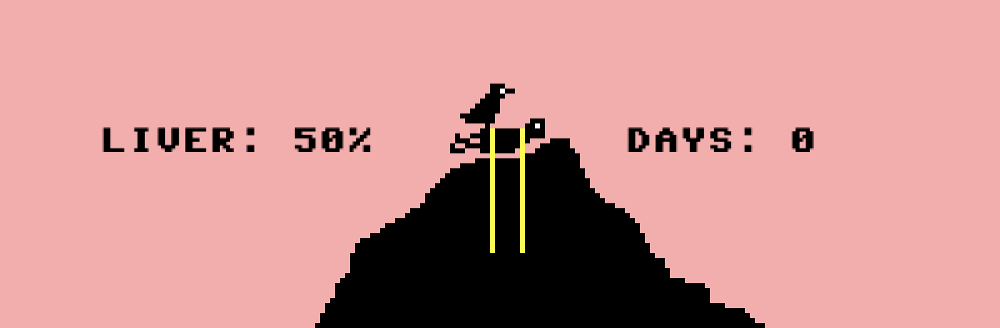
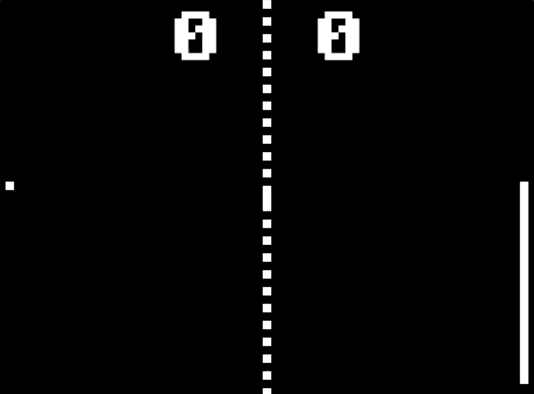
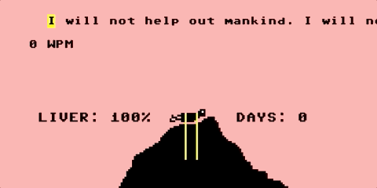
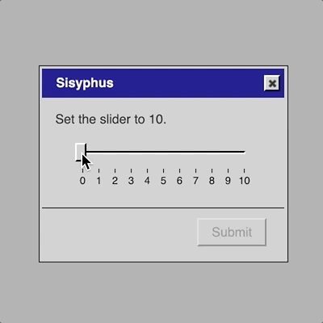
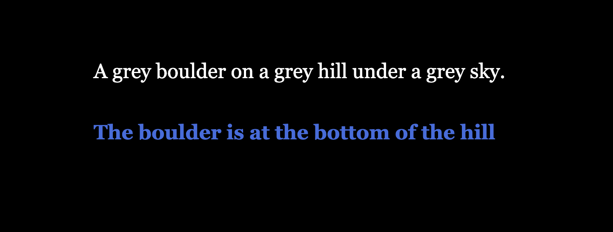

# Let’s Prototype Ancient Greek Punishment

*A very short-form game design workshop.*

In which, we take on three constraints in order to prototype a game in an hour or less!

## Let’s Play: Ancient Greek Punishment

Our starting point is a series of digital games I made between 2011 and 2019 (more to come? will I steal your ideas?) about mythological Greek punishments.

- [The original game](https://pippinbarr.com/lets-play-ancient-greek-punishment/info/) (2011)
- [The variations](https://pippinbarr.com/ideas/ancient-greek-punishment/) (2015–2019)

## Constraints

In order to *actually prototype a game*, we're going to constrain ourselves in three key ways.

1. We'll choose a *pre-existing game* and/or *prototyping materials* (**the form**)
2. We'll choose a *pre-existing story and setting* (**the myth**)
3. We'll choose a *very specific idea or experience we want to communicate* (**the experience**)

---

These things will inevitably influence each other. That's a good thing.

### Example

In my original videogame version of Sisyphus, for example, I had

1. Form: simple minigames in the style of WarioWare
2. Myth: Sisyphus (aka. guy pushing a rock up a hill forever)
3. Experience goal: communicate *eternal* punishment dynamically, alluding to the repetitive (pointless?) labour of many videogames (so deep)

## Why do this?

- Understand [The Stuff Games Are Made Of](https://mitpress.mit.edu/9780262546119/the-stuff-games-are-made-of/)
- Training as a [Reflective Practitioner](https://hci.stanford.edu/publications/bds/9-schon.html)
- Understand Greek Mythology in a New Way
- Communicate your ideas in the language of play
- Constraints Are Good For Creative Process and You Know It

## 1. The form

When you're making a game in a small amount of time, or are just inexperienced, a great way to start out is with a game or activity that *already exists* and just... *change it*.

- [PONGS](https://pippinbarr.com/pongs/info/) (2012)
- [BREAKSOUT](https://pippinbarr.com/breaksout/info/) (2015)
- [SNAKISMS](https://pippinbarr.com/SNAKISMS/info/) (2017)
- [CHESSES](https://pippinbarr.com/chesses/info/) (2019)

We're not going to have time to make digital game variations, so we'll need to choose games/activities that we can prototype in non-virtual reality.

What forms could we work from?

### Bodies?

- Folk games (hopscotch, tag, hide and seek, ...)
- Sports (wrestling, hurdles, baseball, ...)
- Exercise (pushups, situps, running, ...)
- Literalism (pushing a heavy object, chaining someone to a rock, ...)

### Analog games?

- Cards (go fish, poker, snap, ...)
- Dice (gambling, yahtzee, ...)
- Board games (snakes and ladders, monopoly, chess, ...)
- Language games (I spy, madlibs, 20 questions, ...)
- Social deduction games (werewolf/mafia, the resistance, ...)

### Just Rules?

- Social Media Challenges (the ice-bucket challenge, TikTok dances, face wax, ...)
- Rule-based Conceptual Art (Sol LeWitt, John Cage, fluxus, ...)

---

Let your mind start to see if it gravitates toward any particular games or activities. Familiarity and simplicity are usually a good idea. Try to notice how the materials as well as the rules might be a starting point for your design.

### Examples

(These are just general variations - not so useful for today.)

- "Go Fish" but you have to catch cards as they are thrown to you
- "Snakes and Ladders" but you play as the snakes and ladders
- "Hide and seek" but you all play with your eyes closed within 10 feet of each other
- A TikTok challenge where you film yourself pushing a boulder up a hill every day at 5am
- Holding a plank position while somebody slowly whispers a litany of all the terrible things you did into your ear

These are probably *not good ideas*! But you'll never know unless you *try something*!

## 2. The myth(s)

It can be very helpful to have a specific narrative/story framing available as a kind of *pre-determined* element to your design process. We're going to use myths of punishment from Greek mythology because they are simple and evocative and this workshop is called *Let's Prototype Ancient Greek Punishment*.

- [Sisyphus](https://en.wikipedia.org/wiki/Sisyphus) was sentenced to eternally push a boulder to the top of a slope, only to see it roll back down and to begin again
- [Tantalus](https://en.wikipedia.org/wiki/Tantalus) was hungry and thirsty but every time he reached for a fruit or stooped for water it moved away from him
- [Prometheus](https://en.wikipedia.org/wiki/Prometheus) was chained to a rock and doomed to have an eagle eat his liver every day
- [The Danaids](https://en.wikipedia.org/w/index.php?title=Dana%C3%AFdes) had to fill a bathtub one bucket at a time, but the bathtub had holes that meant they could never fill it
- [Zeno of Elea](https://en.wikipedia.org/w/index.php?title=Zeno_of_Elea) came up with the idea the movement is important because to get somewhere you have to go halfway, then halfway from there, then halfway from there, ... and so on, ... forever?

--

Again, see if your mind gravitates toward one of these naturally and let it start making notional pairings between myth and form.

Find the *specificities* in your myth to help to unlock further potential: consider reading about it in more depth? *Why* were they punished? Did they ever *escape*? Do we know how they *felt* about it all?

### Examples

Different myths may have different affordances for design...

- The myth of Sisyphus involves incredible *physicality and strain*, as well as Camus' assertion that Sisyphus might be... happy???
- The myth of Prometheus involves suffering *inflicted on a restrained body*, a very different dynamic to the endless tasks of the others
- Zeno of Elea was not (as far as we know) punished by the Gods, but should he have been? What would have been a good punishment?
- Tantalus could evoke a key emotion of ever frustrated *longing*
- The Danaids could tell a story of using the wrong tool for the job (don't bring a collinder to carry water)

## 3. The experience

What do we want a player of our game (or simply "experiencer of our experience") to think about and feel?

### Connecting with the Myth?

One option is to use our Form as an opportunity to create a deeper or distinctive connection to the myth itself. We could explore...

- The physicality of the protagonist
- The emotions of the protagonist
  - "The struggle itself towards the heights is enough to fill a man's heart. One must imagine Sisyphus happy." ??? (Albert Camus in [*The Myth of Sisyphus*](https://en.wikipedia.org/wiki/The_Myth_of_Sisyphus))
- The thoughts of the protagonist
- Something High Concept like eternity
- The punisher's (Zeus, usually, right?) perspective (*assigning punishments* would be pretty fun?)
- The broader context and rationale for the punishment

### Myth as Metaphor?

We could also choose to prioritize an experience or idea that the myth is well-suited (combined with our Form) to explore.

- A meditation on punishment in contemporary society? (As "corrective," retribution, reformation, biased, futile, cruel, ...)
- The idea of angering the gods/Fate/Facebook...
- Forgiveness (it's okay to zig)
- Hopeless repetition as a meditation on contemporary life
- How the punishment could have been improved? What would Silicon Valley do? How would techbros disrupt the punishment market?
- The pleasures of repetitive action? The pleasures of *observing* repetitive action?

## Design time

1. Form small teams (2-3 perhaps?)
2. Have a quick chat an introduce yourselves to each other
3. Five minutes (timed!) of high-speed idea generation *individually*
    - We're looking for an idea every 20 seconds (15 ideas total)
    - Each idea should address a specific set of Form, Myth, and Experience
4. Discuss the ideas generated as a team and choose one to prototype
5. 20 minutes (timed!) to prototype it with the materials to hand
    - It doesn’t have to be good! It probably shouldn't be!
    - If you finish early start another prototype!
    - Even if you don't finish make sure you have *something* to show us
    - Give your prototypes *titles*, it is fun!
6. Show and tell time as a group (ideally)
    - Tell us the title and explain the basic form-myth-experience (though keep the experience secret if you want to)
    - Demo your prototype yourselves or with others depending on comfort level

## Some questions for discussion

- How easy did you find it to succinctly express what your prototype is meant to convey?
- And does it convey that? *How* does it?
- What does your myth/experience teach you about your materials?
- What do your materials teach your about your myth/experience?
- Is your prototype "the same as" a written account or animation of the myth? Why?

These are *not the only questions* to think about.
